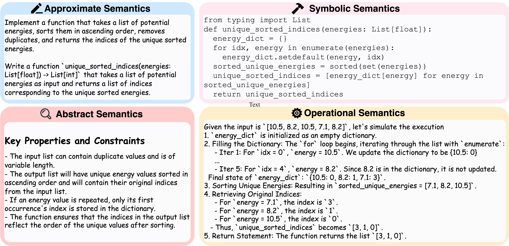
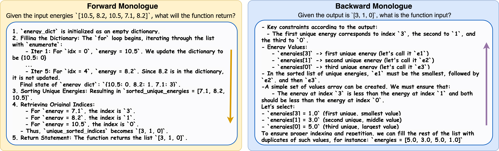

# 🤔 SemCoder: Training Code Language Models with Comprehensive Semantics Reasoning

<p align="center">
    <a href=""></a>
    <a href="https://arxiv.org/abs/2406.01006">
    <a href="https://opensource.org/license/mit/">
    <a href="https://huggingface.co/semcoder">
</p>

<p align="center">
    🔍&nbsp;<a href="#-overview">Overview</a>
    | 🤖&nbsp;<a href="#-models">Models</a>
    | 📚&nbsp;<a href="#-dataset">Dataset</a>
    | 🛠️&nbsp;<a href="#-get-started">Get Started</a>
    | 🧑‍💻&nbsp;<a href="#-experiments">Experiments</a>
    | 📝&nbsp;<a href="#-citation">Citation</a>
    | 🙏&nbsp;<a href="#-acknowledgements">Acknowledgements</a>
</p>

## News

-  🚀 __\[Oct. 30\]__ We have publicly released checkpoints, datasets, and code for SemCoder🔥🔥!!
-  🎉 __\[Sep. 25\]__ SemCoder has been accepted to NeurIPS'24!!  

## Overview

### 🤖 SemCoder: Learning to Reason Comprehensive Code Semantics
- SemCoder not only generates code, but also __comprehensively understands code semantics__.
- We propose to learn varied semantics: from __high-level functionalities__ to __low-level details__, from __static properties__ to __dynamic program states__.
- [SemCoder-S-6.7B](https://huggingface.co/semcoder/semcoder_s_1030) outperforms GPT-3.5-turbo on __code generation__ (HumanEval: 79.3 vs. 76.8; LiveCodeBench-Lite: 27.5 vs. 23.9) and __execution reasoning__ (CRUXEval-I: 63.6 vs. 50.3; CRUXEval-O: 63.9 vs. LiveCodeBench-CodeExecution: 59.0; 61.2 vs. 43.6)

<p align="center">

</p>

### 🤔 Monologue Reasoning: Bridging the Gap Between Static Texts and Dynamic Execution
- Motivated by rubber-duck debugging, we propose __monologue reasoning__, learning to explain dynamic execution by reasoning important values, properties and constraints.
- Monologues are bi-directional: __forward and backward__.
- Monologue is notably more effective than both scratchpad and chain-of-thoughts in reasoning dynamic execution.

<p align="center">

</p>

## Models


| Model      | HF Checkpoints                                               | Size | License                                                                           |
|------------|----------------------------------------------------------|------|-----------------------------------------------------------------------------------|
| SemCoder   | 🤗 [HF Link](https://huggingface.co/semcoder/semcoder_1030)   | 6.7B | [DeepSeek](https://github.com/deepseek-ai/DeepSeek-Coder/blob/main/LICENSE-MODEL) |
| SemCoder-S | 🤗 [HF Link](https://huggingface.co/semcoder/semcoder_s_1030) | 6.7B |[DeepSeek](https://github.com/deepseek-ai/DeepSeek-Coder/blob/main/LICENSE-MODEL) |

## Dataset

* 📚 [PyX](https://huggingface.co/datasets/semcoder/PyX): A fully executable Python datasets with comprehensive code semantics.
* 👨🏼‍🔧 [PyX-R](https://huggingface.co/datasets/semcoder/PyX-R): A Python dataset to teach LLM to perform rubber-duck debugging and self-repair.

## Get Started

### 🛠️ Install Environment
```sh
git clone https://github.com/ARiSE-Lab/SemCoder.git;
cd SemCoder;
conda env create --name semcoder --file=environment.yml;
conda activate semcoder;
export PYTHONPATH=$(pwd);
```

### 🚀 Quick Start
```python
from transformers import pipeline
import torch

generator = pipeline(
  model="semcoder/semcoder_s_1030",
  task="text-generation",
  torch_dtype=torch.float16,
  device_map="auto",
)

# Generate Code

CODEGEN_REQUEST = """You are an exceptionally intelligent coding assistant that consistently delivers accurate and reliable <Code> according to <NL_Description>

<NL_Description>
{desc}

<Code>
"""
desc = """You are tasked with implementing a Python class that simulates a simple version of a "To-Do List" application. The class should have the following functionalities:
1. Add a new task to the to-do list.
2. Mark a task as completed.
3. Display all tasks in the to-do list.
4. Display only the incomplete tasks in the to-do list.
"""

prompt = CODEGEN_REQUEST.format(desc=desc)
result = generator(prompt, max_length=2048, num_return_sequences=1, temperature=0.0)
code = result[0]["generated_text"].split("```python")[1].split("```")[0]
print(code)

# Understand Code with Monologues

FWD_MNL_REQUEST = """Simulate the Execution: You are given a Python function and an assertion containing a function input. Complete the assertion containing the execution output corresponding to the given input in [ANSWER] and [/ANSWER] tags.
{code}
"""

tests = """
todo_list = ToDoList()
todo_list.add_task("Buy groceries")
todo_list.add_task("Complete assignment")
todo_list.mark_completed("Buy groceries")
assert todo_list.tasks == ???
"""
code += tests
prompt = FWD_MNL_REQUEST.format(code=code)
result = generator(prompt, max_length=2048, num_return_sequences=1, temperature=0.0)
print(result[0]["generated_text"])
```

### 🕹️ Demo

We follow [Magicoder](https://github.com/ise-uiuc/magicoder/blob/main/demo/magicoder_demo.py) script to lanuch a gradio server for the local demo. You can launch your local gradio demo as following:

```bash
CUDA_VISIBLE_DEVICES=0 python semcoder_demo.py \
   --base_model "semcoder/semcoder_s_1030" \
   --device "cuda:0" \
   --port 8080
```


## Experiments

🧑‍💻 To reproduce evaluation results mentioned in the paper, please see [experiments](experiments/README.md).

## 📝 Citation

```bibtex
@article{ding2024semcoder,
  title={SemCoder: Training Code Language Models with Comprehensive Semantics},
  author={Yangruibo Ding and Jinjun Peng and Marcus J. Min and Gail Kaiser and Junfeng Yang and Baishakhi Ray},
  journal={arXiv preprint arXiv:2406.01006},
  year={2024}
}
```

## 🙏 Acknowledgements

My favorite quote of 2024 from the GREAT Andrej Karpathy ([No Priors Ep. 80](https://www.youtube.com/watch?v=hM_h0UA7upI&t=1055s)):
> _The Internet data is not the data you want for your Transformers – a nearest neighbor actually gets you really far, surprisingly. What you want is the ___inner-thought monologue___ of your brain. If we had billions of that, AGI is here, roughly speaking._


We thank the following amazing projects that inspired our design choices:

- [Magicoder](https://github.com/ise-uiuc/magicoder): Synthetic Code Generation.
- [EvalPlus](https://github.com/evalplus/evalplus): Test-case Generation & Augmentation.
- [DeepSeek-Coder](https://github.com/deepseek-ai/DeepSeek-Coder): Base model for SemCoder.

The template of this README is also borrowed from [Magicoder](https://github.com/ise-uiuc/magicoder).
